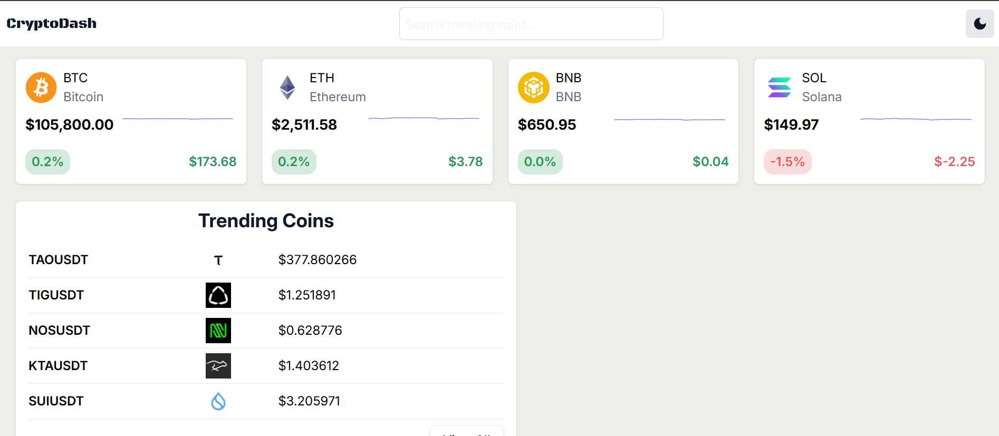

# React + Vite

# Crypto‑Dash 🚀

A clean, real-time cryptocurrency dashboard built with modern web technologies, offering live price updates, historical charts, and portfolio tracking.

## Table of Contents

- [Demo](#demo)
- [Features](#features)
- [Tech Stack](#tech-stack)
- [Prerequisites](#prerequisites)
- [Getting Started](#getting-started)
---

## Demo


- **Live demo**: [https://crypto-dash-pied.vercel.app/]  
- 

---

## Features

- **Real-time price updates** for major cryptocurrencies  
- **Historical price charts** with interactive UI & charts  
- **Dark & Light mode** for personalized experience  
- **Responsive design**: mobile, tablet, desktop ready  


---

## Tech Stack

- **Frontend**: React + Vite  
- **Charts**: Recharts  
- **State Management**: React Context for theme  
- **API**: CoinGecko  
- **Styling**: Tailwind CSS  

---

## Prerequisites

Ensure you have installed:

- [Node.js](https://nodejs.org/) v16+  
- npm v8+ (or yarn v1.22+)  
- API keys for data provider (CoinGecko)

---

## Getting Started

1. **Clone the repository**
   ```bash
   git clone https://github.com/ClarenceG01/crypto-dash.git
   cd crypto-dash
2. **Install dependencies**
   ```bash
   npm install
# or yarn install

3. **Configure environment variables**
   ```bash
   VITE_API_KEY='your api key from coingecko'
4. **Run the development server**
   ```bash
   npm run dev
  # or yarn dev
5. **Open http://localhost:5173 to explore Crypto‑Dash**
   


